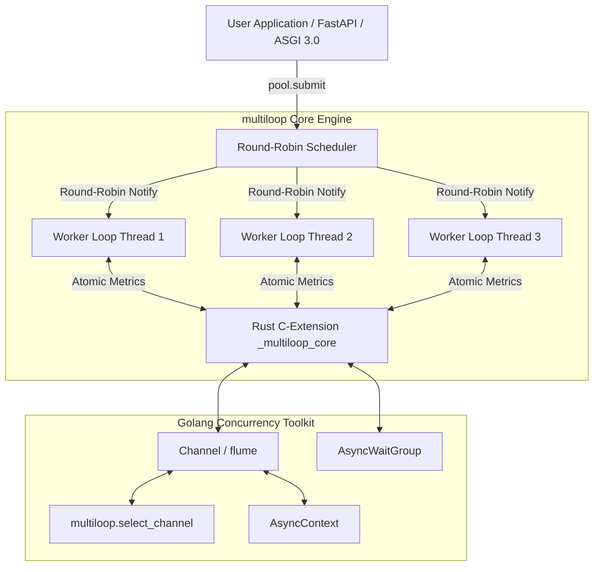

# multiloop: Multi-Event-Loop Engine & Concurrency Toolkit for Python 3.14t

[](https://github.com/hankaihong1/multiloop/actions/workflows/ci.yml)
[](https://www.python.org/)
[](LICENSE)

**[中文版 (Chinese)](README_ZH.md)**

## Table of Contents

- [Introduction](#introduction)
- [Installation](#installation)
- [Architecture](#architecture)
- [Core Features](#core-features)
- [Examples](#examples)
- [Live Demo](#live-demo)
- [API Reference](#api-reference)
- [Quality & Tests](#quality--tests)
- [Community Docs](#community-docs)
- [License](#license)

---

## Introduction

`multiloop` is a high-performance multi-event-loop thread pool and Go-level
concurrency primitive toolkit designed exclusively for **Python 3.14t
(Free-Threaded / no-GIL)**. It features an `asyncssh`-style top-level API
facade, supporting both zero-config top-level function access and explicit
thread pool management.

---

## Installation

### Prerequisites

- **Python 3.14+**: Free-Threaded (no-GIL) build, e.g. `3.14t`.
- **Rust stable toolchain**: to compile the `_multiloop_core` C extension from source.

### Install with pip

```bash
pip install multiloop
```

### Install with uv

```bash
uv add multiloop
```

### Build from source

```bash
# After cloning, build and install into the current environment with maturin
maturin develop --release
```

> **Note**: install `maturin` (`pip install maturin` or `uv tool install maturin`)
> and the Rust stable toolchain (via [rustup](https://rustup.rs)) first.

---

## Architecture



---

## Core Features

- ⚡ **True Multithreaded Parallelism**: breaks the GIL entirely, achieving up
  to **3.48x+ physical multi-core speedup** in Python 3.14t environments.
- 🎯 **Round-Robin Worker Distribution**: tasks are pushed into a shared
  lock-free queue; worker threads pull and execute via a work-stealing model,
  with wake-up notifications distributed round-robin across worker loops.
- 🦀 **Rust Engine (`_multiloop_core`)**: lock-free primitives and the C
  extension are written in Rust (PyO3 + `flume` + `parking_lot`), delivering
  zero busy-wait (0% CPU idle) and extreme channel throughput.
- 🚀 **`asyncssh`-Style Top-Level API Facade**: minimal API surface such as
  `multiloop.select_channel(...)` and `multiloop.EventLoopThreadPool`, with pool
  lifecycle managed via `async with`.
- 🦫 **Golang-Style Concurrency Primitives**:
  - `Channel` (elegant iteration via `async for item in ch:`)
  - `multiloop.select_channel(*channels)` (multi-channel select/multiplex)
  - `AsyncContext` (cross-thread cascading task cancellation and timeout broadcast)
  - `AsyncWaitGroup` & `AsyncOnce` & `AsyncRWMutex` (read-write lock separation)
- 🌐 **High-Performance Web Engines**:
  - `MultiloopASGIWorker`: Mount FastAPI / Starlette / ASGI 3.0 with Lifespan & RFC 6455 WebSockets.
  - `MultiloopWSGIWorker`: Run synchronous Django / Flask (PEP 3333) with lock-free streaming response channels.
  - `multiloop run` CLI runner for zero-downtime serving and hot reloading.

---

## Current Status & Known Limits

**multiloop is an experimental project for free-threaded CPython (3.14t).** Its
concurrency core has been through ten systematic audit rounds (R6–R10), each
ending with deterministic reproduction tests and stress verification
(`pytest --count=50`) — [docs/CONCURRENCY.md](docs/CONCURRENCY.md) is the
operating manual. The API is 0.x: expect behavioural refinements between
releases. If you build on it, pin the version.

### Verified performance (M1 8GB, Python 3.14t)

| Workload | Single loop | multiloop 4-worker | Speedup |
|---|---|---|---|
| CPU-bound dispatch (40 × 2M ops) | 2.96 s | 0.84 s | **3.5x** |
| Mixed I/O + CPU (400 tasks, 2 ms sleep + 40k ops) | 511 QPS | 1259 QPS | **2.5x** |
| Pure-I/O ASGI HTTP (500 req, 50 conn) | 59.6 QPS | 74.7 QPS | 1.25x |

The engine's value is **parallel CPU-bound work across event loops**. For
pure-I/O HTTP serving, a single asyncio loop (or uvicorn) is the better tool.

### Known limits (read before adopting)

| Limit | Detail | Escape hatch |
|---|---|---|
| Requires Python 3.14t | free-threaded CPython is still experimental (PEP 703) | — |
| `Barrier` + cancelled party | a party cancelled before the round completes leaves the rest parked forever | `abort()` |
| `select_channel` arbitration | readiness is reported without consuming; heavy contention can delay a specific channel | built-in re-register loop |
| Waiter removal is O(n) | cancelling N parked waiters is O(n²) — ~560 ms at 5000 waiters | keep party counts realistic |
| `AsyncContext.cancel()` | cancels the *awaiters*, not the running pool task (no injection) | design tasks to observe their future |
| `CancelScope` shield | absorbs cancellations already injected before entry; does **not** defer new ones (unlike trio/anyio) | retry-loop pattern (CONCURRENCY.md §2 Pattern 3) |
| Windows | Proactor: exactly one acceptor (shared-listener multi-acceptor hangs) | documented behaviour |

---

## Examples

### 1. Top-Level Zero-Config Usage (`asyncssh`-style)

```python
import asyncio
import multiloop


async def heavy_task(x: int):
    await asyncio.sleep(0.01)
    return x * 2


async def main():
    # async with manages the thread pool lifecycle automatically
    async with multiloop.EventLoopThreadPool() as pool:
        # Submit an async coroutine (shared queue + work-stealing scheduler)
        fut1 = pool.submit(heavy_task, 21)

        # Explicitly target a worker loop (stateful connection affinity)
        fut2 = pool.submit(heavy_task, 21, pin_to=0)  # Output: 42

        # Inspect pool health metrics
        print("Metrics:", pool.get_metrics())

    # Leaving the async with block shuts down gracefully


if __name__ == "__main__":
    asyncio.run(main())
```

### 2. Go-Style Channel Iteration and `multiloop.select_channel`

```python
import asyncio
import multiloop


async def main():
    ch1 = multiloop.Channel()
    ch2 = multiloop.Channel()

    async def producer():
        await ch1.send("Data from Channel 1")
        ch1.close()

    asyncio.create_task(producer())

    # select_channel waits for the first channel that becomes ready
    selected_ch, val = await multiloop.select_channel(ch1, ch2)
    print(f"Received: {val}")


if __name__ == "__main__":
    asyncio.run(main())
```

### 3. Concurrent Task Synchronization (Golang `sync.WaitGroup` style)

```python
import asyncio
import multiloop


async def worker(name: str, wg: multiloop.AsyncWaitGroup):
    try:
        await asyncio.sleep(0.02)  # simulated work
        print(f"worker {name} done")
    finally:
        wg.done()  # decrement the counter on both success and failure


async def main():
    wg = multiloop.AsyncWaitGroup()

    # Dispatch 5 tasks across a 4-thread pool
    async with multiloop.EventLoopThreadPool(num_threads=4) as pool:
        for i in range(5):
            wg.add()  # increment the counter
            pool.submit(worker, f"task-{i}", wg)

        # Block until all tasks finish (counter reaches zero)
        await wg.wait()
        print("all workers finished")


if __name__ == "__main__":
    asyncio.run(main())
```

### 4. Structured Concurrency with Timeout Control

```python
import asyncio
import multiloop


async def fetch(name: str, delay: float):
    await asyncio.sleep(delay)  # simulated network latency
    return f"{name}: ok"


async def main():
    try:
        # fail_after sets an overall timeout (0.1 s) for the whole block
        async with multiloop.fail_after(0.1):
            async with multiloop.TaskGroup() as tg:
                # start_soon spawns a child task immediately, returning a TaskHandle
                h1 = tg.start_soon(fetch, "fast", 0.01)
                h2 = tg.start_soon(fetch, "slow", 0.5)

            # All child tasks are guaranteed finished when leaving the block
            print(await h1, "|", await h2)
    except TimeoutError:
        print("timed out: children did not finish within 0.1 s")


if __name__ == "__main__":
    asyncio.run(main())
```

More runnable examples: [`examples/`](examples/README.md)

---

## Live Demo

Want to see it running without writing code?
[multiloop-fastapi-demo](https://github.com/hankaihong1/multiloop-fastapi-demo) is
a real FastAPI application served directly by `MultiloopASGIWorker` — no
uvicorn involved. Its page doubles as a live dashboard: every 2 seconds it
pulls real metrics from `EventLoopThreadPool.get_metrics()` and shows which
of the 4 event-loop threads handled each request.

```bash
git clone https://github.com/hankaihong1/multiloop-fastapi-demo
cd multiloop-fastapi-demo
uv sync
uv run python app.py        # then open http://127.0.0.1:8000
```

---

## API Reference

Complete API documentation: [docs/API.md](docs/API.md).

Not sure which primitive to use? See the decision table in
[docs/CHOOSING.md](docs/CHOOSING.md).

---

## Quality & Tests

```bash
# 1. Lint & static checks (0 errors)
uv run ruff check .

# 2. Full automated test suite
uv run pytest
```

---

## Community Docs

- [CONTRIBUTING.md](CONTRIBUTING.md) — Contribution Guide
- [CHANGELOG.md](CHANGELOG.md) — Changelog
- [SECURITY.md](SECURITY.md) — Security Policy
- [CODE_OF_CONDUCT.md](CODE_OF_CONDUCT.md) — Code of Conduct
- [AGENTS.md](AGENTS.md) — AI Development Guide

---

## License

MIT License. See [LICENSE](LICENSE) for details.
