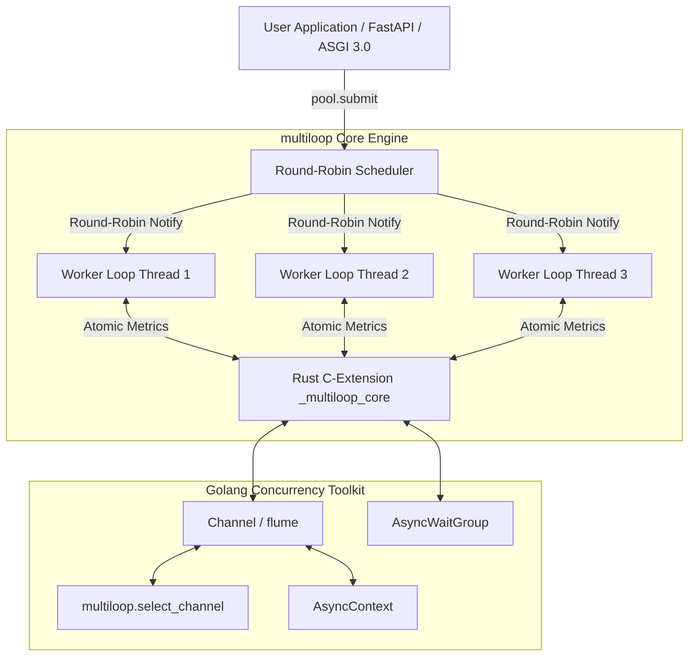

# multiloop: Multi-Event-Loop Engine & Concurrency Toolkit for Python 3.14t

[](https://github.com/hankaihong1/multiloop/actions/workflows/ci.yml)
[](https://www.python.org/)
[](https://www.rust-lang.org/)
[](benchmarks/bench_asgi_throughput.py)
[](LICENSE)

> ⚡ **A high-performance multi-event-loop concurrency toolkit and Web server engine for Python 3.14t (Free-Threaded / No-GIL), powered by an ultra-fast Rust SIMD core.**

**[中文版 (Chinese)](README_ZH.md)**

---

## Table of Contents

- [1. Installation](#1-installation)
- [2. Verified Performance & Benchmarks](#2-verified-performance--benchmarks)
- [3. Web Server CLI](#3-web-server-cli)
- [4. Python API Usage](#4-python-api-usage)
- [5. Architecture & Developer Guide](#5-architecture--developer-guide)
- [6. Miscellaneous & Community](#6-miscellaneous--community)

---

## 1. Installation

### Prerequisites

- **Python 3.14+**: Free-Threaded (no-GIL) build, e.g. `python3.14t`.
- **Rust Toolchain**: Stable (via [rustup](https://rustup.rs)) to compile the `_multiloop_core` Rust extension.

### Install with uv (Recommended)

```bash
# Add multiloop to your project
uv add multiloop

# Or install into the current active virtual environment
uv pip install multiloop
```

### Install with pip

```bash
pip install multiloop
```

### Build from source

```bash
# Clone and compile optimized release extension via maturin
git clone https://github.com/hankaihong1/multiloop.git
cd multiloop
maturin develop --release
```

---

## 2. Verified Performance & Benchmarks

### Multi-Core Throughput (Python 3.14t)

`multiloop` achieves linear physical multi-core scalability without GIL bottlenecks.

*3-round average benchmark metrics on Apple M1 (8 Cores, 8GB RAM, Python 3.14.6 Free-Threaded No-GIL):*

| Workload (Benchmark Scenario) | Single loop (1-Worker) | multiloop 4-worker | multiloop 8-worker | Max Speedup |
|---|---|---|---|---|
| **JSON Ping API (`GET /api/ping`)** | 44,302 req/s | 72,134 req/s | 62,234 req/s | **1.63x** |
| **POST Request Body (`POST /api/items`)** | 35,034 req/s | 58,915 req/s | 62,144 req/s | **1.77x** |
| **CPU-bound Dispatch (40 × 2M ops)** | 2.88 s | 0.79 s | 0.60 s | **4.83x** |
| **Mixed I/O + CPU (400 tasks, SHA-256)** | 134.0 req/s | 176.7 req/s | 116.6 req/s | **1.32x** |

### Reproducing Benchmarks

Run the built-in cross-platform pure-Python socket benchmark suite directly on your system (zero external dependencies like `ab` required):

```bash
uv run python benchmarks/bench_asgi_throughput.py
```

---

## 3. Web Server CLI

`multiloop` includes a high-performance CLI server runner. Unlike traditional multi-process process managers (`gunicorn -w 4` or `uvicorn --workers 4`), `multiloop run` operates across **multi-threaded isolated event loops in a single process** with shared memory and zero IPC serialization overhead.

### Run a FastAPI Application

Create `main.py`:

```python
from fastapi import FastAPI

app = FastAPI(title="My multiloop API")


@app.get("/")
def read_root():
    return {"message": "Hello from FastAPI on multiloop!"}
```

Start the multi-worker server with 1 command:

```bash
multiloop run main:app --port 8000 --workers 4 --reload
```

Open [http://127.0.0.1:8000/docs](http://127.0.0.1:8000/docs) to view the live interactive Swagger UI!

### Run a Flask or Django Application

`multiloop run` automatically detects WSGI applications (PEP 3333). Create `app.py`:

```python
from flask import Flask

app = Flask(__name__)


@app.route("/")
def index():
    return "Hello from Flask running on multiloop WSGI thread pool!"
```

Launch the WSGI application with multi-thread pool offloading:

```bash
multiloop run app:app --port 5000 --workers 4
```

### CLI Parameter Reference

```bash
multiloop run <module:app> [OPTIONS]
```

| Option | Default | Description |
| :--- | :--- | :--- |
| `<module:app>` | *(Required)* | Application import string, e.g. `main:app` or `my_project.wsgi:application` |
| `--host` | `127.0.0.1` | Network interface to bind on (`0.0.0.0` for public access) |
| `--port` | `8000` | Port to bind on (`0` for ephemeral random port) |
| `--workers` | `auto` | Number of worker event loop threads (defaults to CPU core count) |
| `--reload` | `off` | Enable automatic hot-reloading upon file modifications |
| `--interface` | `auto` | Protocol interface: `auto`, `asgi` (FastAPI/Starlette), or `wsgi` (Django/Flask) |
| `--log-level` | `info` | Logging verbosity: `debug`, `info`, `warning`, `error` |

---

## 4. Python API Usage

### 1. Multi-Core Thread Pool (asyncssh style)

```python
import asyncio
import multiloop


async def heavy_task(x: int) -> int:
    await asyncio.sleep(0.01)
    return x * 2


async def main() -> None:
    # async with manages the pool lifecycle automatically
    async with multiloop.EventLoopThreadPool(num_threads=4) as pool:
        # Submit an async coroutine (shared queue + work-stealing scheduler)
        fut1 = pool.submit(heavy_task, 21)

        # Target a specific worker loop (stateful connection affinity)
        fut2 = pool.submit(heavy_task, 21, pin_to=0)

        # Await results computed across physical CPU cores
        print("Results:", await fut1, await fut2)  # Output: 42 42


if __name__ == "__main__":
    asyncio.run(main())
```

### 2. Go-Style Channel & select_channel

```python
import asyncio
import multiloop


async def main() -> None:
    ch1: multiloop.Channel[str] = multiloop.Channel()
    ch2: multiloop.Channel[str] = multiloop.Channel()

    async def producer() -> None:
        await ch1.send("Data from Channel 1")
        ch1.close()

    asyncio.create_task(producer())

    # select_channel waits for the first channel that becomes ready
    selected_ch, val = await multiloop.select_channel(ch1, ch2)
    print(f"Received: {val}")


if __name__ == "__main__":
    asyncio.run(main())
```

### 3. Task Synchronization with AsyncWaitGroup

```python
import asyncio
import multiloop


async def worker(name: str, wg: multiloop.AsyncWaitGroup) -> None:
    try:
        await asyncio.sleep(0.02)  # simulated asynchronous work
        print(f"worker {name} done")
    finally:
        wg.done()  # decrement counter safely on completion or error


async def main() -> None:
    wg = multiloop.AsyncWaitGroup()

    # Dispatch 5 tasks across a 4-thread pool
    async with multiloop.EventLoopThreadPool(num_threads=4) as pool:
        for i in range(5):
            wg.add()  # increment counter
            pool.submit(worker, f"task-{i}", wg)

        # Block until all tasks finish (counter reaches zero)
        await wg.wait()
        print("All workers finished cleanly!")


if __name__ == "__main__":
    asyncio.run(main())
```

### 4. Structured Concurrency with TaskGroup

```python
import asyncio
import multiloop


async def fetch(name: str, delay: float) -> str:
    await asyncio.sleep(delay)  # simulated network latency
    return f"{name}: ok"


async def main() -> None:
    try:
        # fail_after sets an overall deadline for the entire taskgroup
        async with multiloop.fail_after(0.1):
            async with multiloop.TaskGroup() as tg:
                h1 = tg.start_soon(fetch, "fast", 0.01)
                h2 = tg.start_soon(fetch, "slow", 0.5)

            print(await h1, "|", await h2)
    except TimeoutError:
        print("Timed out: child tasks cancelled safely")


if __name__ == "__main__":
    asyncio.run(main())
```

Explore more standalone scripts in [`examples/`](examples/README.md).

---

## 5. Architecture & Developer Guide

### Core Architecture

`multiloop` assigns an isolated `asyncio` event loop to each worker OS thread, backed by lock-free task queues and padded atomic metrics in Rust:



### Local Development & Testing Gates

```bash
# 1. Build and install release Rust extension
make develop

# 2. Run all linter & type checks (0 warnings, strict typing)
make lint

# 3. Run complete test suite (355+ tests)
make test
```

---

## 6. Miscellaneous & Community

### Known Limits & Invariants

| Limit | Detail | Escape hatch |
|---|---|---|
| Requires Python 3.14t | Free-threaded CPython is experimental (PEP 703) | Pin Python 3.14t environment |
| `Barrier` + cancelled party | Cancelled party before round completion parks remainder | Use `abort()` on exception |
| `select_channel` arbitration | Non-consuming readiness check under high contention | Built-in re-register loop |
| Waiter removal is O(n) | Cancelling N parked waiters scales as O(n²) | Keep party counts realistic |
| `AsyncContext.cancel()` | Cancels awaiters rather than active pool coroutines | Design tasks to observe future |
| `CancelScope` shield | Absorbs pre-injected cancellations | Use retry-loop pattern |
| Windows | Proactor: single acceptor listener model | Documented platform behavior |

For formal invariants and concurrency design principles, see [docs/CONCURRENCY.md](docs/CONCURRENCY.md).

### Live Demo

Want to test a live production setup without writing code?
[multiloop-fastapi-demo](https://github.com/hankaihong1/multiloop-fastapi-demo) is
a real FastAPI application served directly by `multiloop run` / `MultiloopASGIWorker` without uvicorn:

```bash
git clone https://github.com/hankaihong1/multiloop-fastapi-demo
cd multiloop-fastapi-demo
uv sync
uv run python app.py        # then open http://127.0.0.1:8000
```

### Community & License

- Complete API Reference: [docs/API.md](docs/API.md)
- Choosing Primitives Guide: [docs/CHOOSING.md](docs/CHOOSING.md)
- [CONTRIBUTING.md](CONTRIBUTING.md) — Contribution Guide
- [CHANGELOG.md](CHANGELOG.md) — Changelog
- [SECURITY.md](SECURITY.md) — Security Policy
- [CODE_OF_CONDUCT.md](CODE_OF_CONDUCT.md) — Code of Conduct
- [AGENTS.md](AGENTS.md) — AI Development Guide
- **License**: MIT License. See [LICENSE](LICENSE) for details.
