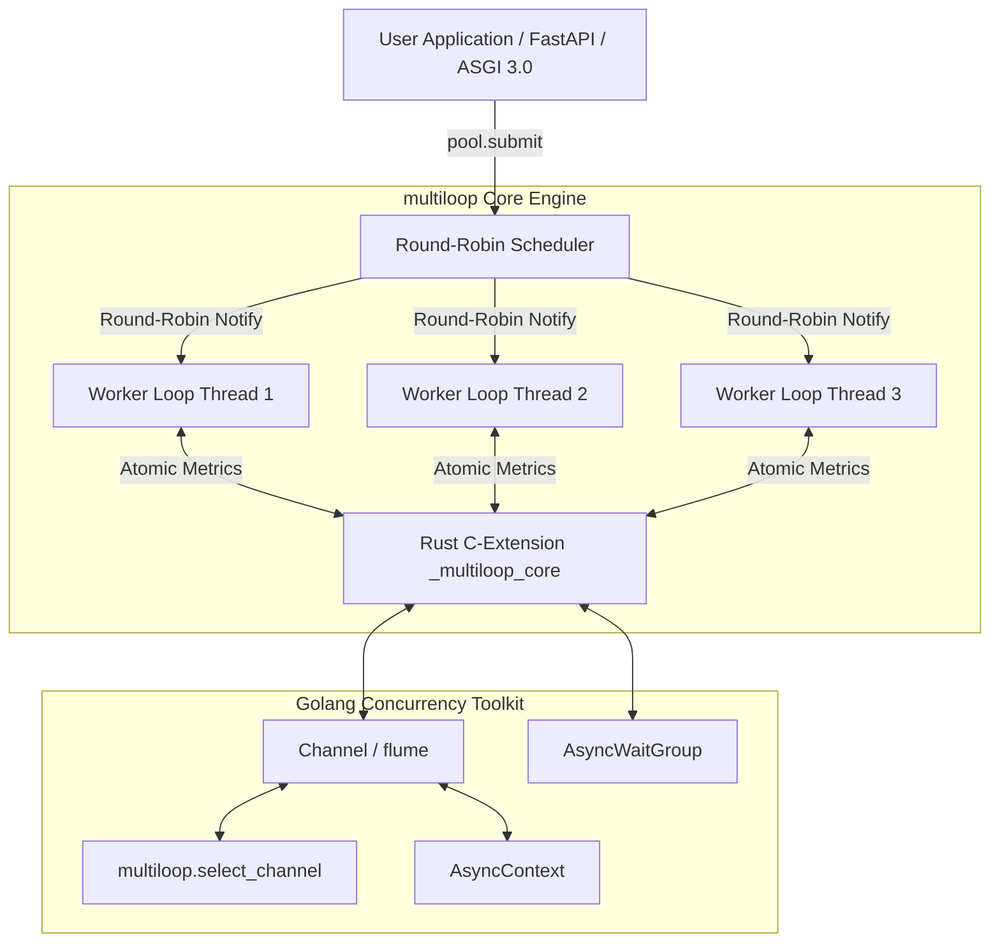

# multiloop: 面向 Python 3.14t 的多事件循环并发引擎与工具包

[](https://github.com/hankaihong1/multiloop/actions/workflows/ci.yml)
[](https://www.python.org/)
[](https://www.rust-lang.org/)
[](benchmarks/bench_asgi_throughput.py)
[](LICENSE)

> ⚡ **专为 Python 3.14t（Free-Threaded / No-GIL 无全局解释器锁）设计的高性能多事件循环并发工具包与 Web 服务器引擎，底层由超高性能 Rust SIMD 核心驱动。**

**[English Version (英文原版)](README.md)**

---

## 目录

- [1. 安装指南](#1-安装指南)
- [2. 性能指标与基准测试](#2-性能指标与基准测试)
- [3. 命令行服务器 (CLI)](#3-命令行服务器-cli)
- [4. 核心 API 编程用法](#4-核心-api-编程用法)
- [5. 架构原理与开发者指南](#5-架构原理与开发者指南)
- [6. 社区生态与附录](#6-社区生态与附录)

---

## 1. 安装指南

### 前置环境要求

- **Python 3.14+**：自由线程（no-GIL）构建版本，例如 `python3.14t`。
- **Rust Toolchain**：Stable 版本（通过 [rustup](https://rustup.rs) 安装），用于从源码编译 `_multiloop_core` 扩展。

### 使用 uv 极速安装 (推荐)

```bash
# 将 multiloop 添加到项目中
uv add multiloop

# 或直接安装到当前激活的虚拟环境中
uv pip install multiloop
```

### 使用 pip 安装

```bash
pip install multiloop
```

### 从源码编译安装

```bash
# 克隆仓库并通过 maturin 编译 release 扩展
git clone https://github.com/hankaihong1/multiloop.git
cd multiloop
maturin develop --release
```

---

## 2. 性能指标与基准测试

### 多物理核高并发吞吐实测

`multiloop` 在无 GIL 锁环境下实现物理多核算力的线性扩展与超高网络吞吐。

*在 Apple M1（8 核心、8GB 内存、Python 3.14.6 Free-Threaded No-GIL 纯线程环境）下进行 3 轮独立压测的平均指标：*

| 工作负载 (Benchmark 压测场景) | 单 loop (1-Worker) | multiloop 4-worker | multiloop 8-worker | 最高加速比 |
|---|---|---|---|---|
| **JSON Ping 接口 (`GET /api/ping`)** | 44,302 req/s | 72,134 req/s | 62,234 req/s | **1.63x** |
| **POST 请求体解析 (`POST /api/items`)** | 35,034 req/s | 58,915 req/s | 62,144 req/s | **1.77x** |
| **CPU 密集任务调度 (40 × 200 万次运算)** | 2.88 s | 0.79 s | 0.60 s | **4.83x** |
| **I/O + CPU 混合计算 (400 任务，SHA-256)** | 134.0 req/s | 176.7 req/s | 116.6 req/s | **1.32x** |

### 一键复现基准测试

在您自己的机器上运行纯 Python 跨平台基准压测套件（零外部命令依赖）：

```bash
uv run python benchmarks/bench_asgi_throughput.py
```

---

## 3. 命令行服务器 (CLI)

`multiloop` 自带开箱即用的命令行 Web 运行器。与传统的跨进程服务器（如 `gunicorn -w 4` 或 `uvicorn --workers 4`）不同，`multiloop run` 在**单一进程内调度多线程隔离的事件循环**，实现真正的内存共享与超高并发。

### 运行 FastAPI 应用程序

创建一个标准的 FastAPI 应用文件 `main.py`：

```python
from fastapi import FastAPI

app = FastAPI(title="My multiloop API")


@app.get("/")
def read_root():
    return {"message": "Hello from FastAPI on multiloop!"}
```

一行命令启动多物理事件循环服务器：

```bash
multiloop run main:app --port 8000 --workers 4 --reload
```

在浏览器中打开 [http://127.0.0.1:8000/docs](http://127.0.0.1:8000/docs) 即可体验交互式 Swagger UI 控制台！

### 运行 Flask 或 Django 应用程序

`multiloop run` 会自动识别 WSGI 应用（PEP 3333 规范）。创建 `app.py`：

```python
from flask import Flask

app = Flask(__name__)


@app.route("/")
def index():
    return "Hello from Flask running on multiloop WSGI thread pool!"
```

启动带有底层多核事件循环线程池的 WSGI 服务：

```bash
multiloop run app:app --port 5000 --workers 4
```

### CLI 命令行参数参考

```bash
multiloop run <module:app> [OPTIONS]
```

| 选项参数 | 默认值 | 功能说明 |
| :--- | :--- | :--- |
| `<module:app>` | *(必填)* | 应用导入路径，例如 `main:app` 或 `my_project.wsgi:application` |
| `--host` | `127.0.0.1` | 绑定的网络监听接口（公网访问可设为 `0.0.0.0`） |
| `--port` | `8000` | 绑定的网络监听端口（`0` 表示随机动态端口） |
| `--workers` | `auto` | 启动的工作事件循环线程数（默认自动匹配物理 CPU 核心数） |
| `--reload` | `off` | 开启源代码文件修改自动热重载 |
| `--interface` | `auto` | 协议类型：`auto` 自动检测、`asgi` (FastAPI/Starlette) 或 `wsgi` (Django/Flask) |
| `--log-level` | `info` | 日志输出级别：`debug`, `info`, `warning`, `error` |

---

## 4. 核心 API 编程用法

### 1. 顶层零配置多核线程池 (asyncssh 风格)

```python
import asyncio
import multiloop


async def heavy_task(x: int) -> int:
    await asyncio.sleep(0.01)
    return x * 2


async def main() -> None:
    # 使用 async with 自动管理线程池生命周期
    async with multiloop.EventLoopThreadPool(num_threads=4) as pool:
        # 提交异步协程任务 (共享队列 + 工作窃取调度)
        fut1 = pool.submit(heavy_task, 21)

        # 显式指定目标 Worker Loop (有状态连接亲和性)
        fut2 = pool.submit(heavy_task, 21, pin_to=0)

        # 等待物理 CPU 多核计算完成并返回结果
        print("Results:", await fut1, await fut2)  # 输出: 42 42


if __name__ == "__main__":
    asyncio.run(main())
```

### 2. Go 风格 Channel 与 select_channel

```python
import asyncio
import multiloop


async def main() -> None:
    ch1: multiloop.Channel[str] = multiloop.Channel()
    ch2: multiloop.Channel[str] = multiloop.Channel()

    async def producer() -> None:
        await ch1.send("Data from Channel 1")
        ch1.close()

    asyncio.create_task(producer())

    # select_channel 等待第一个就绪的通道
    selected_ch, val = await multiloop.select_channel(ch1, ch2)
    print(f"Received: {val}")


if __name__ == "__main__":
    asyncio.run(main())
```

### 3. 多任务同步 AsyncWaitGroup

```python
import asyncio
import multiloop


async def worker(name: str, wg: multiloop.AsyncWaitGroup) -> None:
    try:
        await asyncio.sleep(0.02)  # 模拟异步处理
        print(f"worker {name} done")
    finally:
        wg.done()  # 无论成功或异常均安全递减计数器


async def main() -> None:
    wg = multiloop.AsyncWaitGroup()

    # 在 4 线程池中分发 5 个任务
    async with multiloop.EventLoopThreadPool(num_threads=4) as pool:
        for i in range(5):
            wg.add()  # 增加计数
            pool.submit(worker, f"task-{i}", wg)

        # 阻塞等待所有任务执行完毕 (计数归零)
        await wg.wait()
        print("All workers finished cleanly!")


if __name__ == "__main__":
    asyncio.run(main())
```

### 4. 结构化并发与 TaskGroup 超时控制

```python
import asyncio
import multiloop


async def fetch(name: str, delay: float) -> str:
    await asyncio.sleep(delay)  # 模拟网络延迟
    return f"{name}: ok"


async def main() -> None:
    try:
        # fail_after 为整个代码块设置整体超时截止时间 (0.1 秒)
        async with multiloop.fail_after(0.1):
            async with multiloop.TaskGroup() as tg:
                h1 = tg.start_soon(fetch, "fast", 0.01)
                h2 = tg.start_soon(fetch, "slow", 0.5)

            print(await h1, "|", await h2)
    except TimeoutError:
        print("Timed out: child tasks cancelled safely")


if __name__ == "__main__":
    asyncio.run(main())
```

更多独立可运行的示例脚本参见 [`examples/`](examples/README_ZH.md)。

---

## 5. 架构原理与开发者指南

### 核心架构设计

`multiloop` 为每个 Worker 线程分配独立的 `asyncio` 事件循环，底层由 Rust 实现无锁队列与 64 字节对齐的原子计数器提供支撑：



### 本地开发与质量检查

```bash
# 1. 编译并安装开发环境 Rust 扩展
make develop

# 2. 运行全量代码风格与静态类型检查 (0 警告，严格模式)
make lint

# 3. 运行完整自动化测试套件 (355+ 测试用例)
make test
```

---

## 6. 社区生态与附录

### 已知限制与运行规则

| 限制 | 详情 | 逃生门 |
|---|---|---|
| 依赖 Python 3.14t | 自由线程 CPython 仍属实验性阶段（PEP 703） | 锁定 Python 3.14t 环境 |
| `Barrier` + 被取消的 party | 某 party 提前取消会使本轮其余等待者无限等待 | 异常时调用 `abort()` |
| `select_channel` 仲裁 | 高竞争下就绪状态不直接消耗数据 | 内置重新注册循环机制 |
| waiter 移除为 O(n) | 取消 N 个已挂起的等待者计算复杂度为 O(n²) | 保持合理的并发等待数 |
| `AsyncContext.cancel()` | 取消的是 await 等待方而非正在运行的协程任务 | 设计任务使其检查 future 状态 |
| `CancelScope` shield | 吸收进入 scope 前已被注入的取消信号 | 采用重试循环模式 |
| Windows | Proactor：单 acceptor 监听器模型 | 系统平台文档化行为 |

详细不变式设计与并发正确性指南参见 [docs/CONCURRENCY_ZH.md](docs/CONCURRENCY_ZH.md)。

### 在线演示项目

想无需编写代码直接体验？
[multiloop-fastapi-demo](https://github.com/hankaihong1/multiloop-fastapi-demo) 是一个由 `multiloop run` / `MultiloopASGIWorker` 直接驱动的真实 FastAPI 演示项目（无需 uvicorn）：

```bash
git clone https://github.com/hankaihong1/multiloop-fastapi-demo
cd multiloop-fastapi-demo
uv sync
uv run python app.py        # 打开浏览器访问 http://127.0.0.1:8000
```

### 社区规范与开源协议

- 完整 API 手册：[docs/API_ZH.md](docs/API_ZH.md)
- 原语选型决策指南：[docs/CHOOSING_ZH.md](docs/CHOOSING_ZH.md)
- [CONTRIBUTING.md](CONTRIBUTING.md) — 贡献指南
- [CHANGELOG.md](CHANGELOG.md) — 版本变更日志
- [SECURITY.md](SECURITY.md) — 安全策略
- [CODE_OF_CONDUCT.md](CODE_OF_CONDUCT.md) — 行为准则
- [AGENTS.md](AGENTS.md) — AI 协作与架构指南
- **开源协议**：MIT License. 详见 [LICENSE](LICENSE)。
