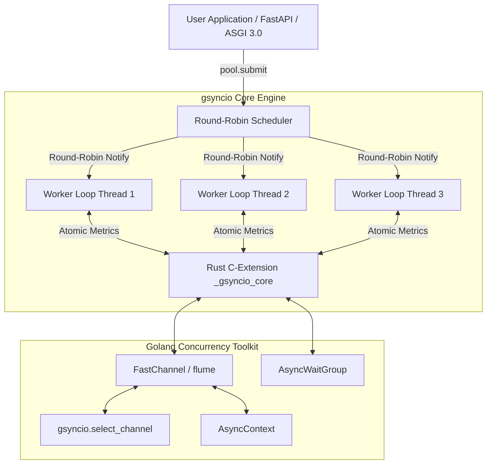

# gsyncio：多事件循环引擎与 Golang 级并发工具包（Python 3.14t）

[](https://github.com/hankaihong1/gsyncio/actions/workflows/ci.yml)
[](https://www.python.org/)
[](LICENSE)

**[English](README.md)**

## 📑 目录

- [简介](#简介-introduction)
- [安装](#安装-installation)
- [架构设计图](#架构设计图-architecture)
- [核心特性](#核心特性-core-features)
- [示例](#示例-examples)
- [API 参考](#api-参考-api-reference)
- [质量与单元测试](#质量与单元测试-quality--tests)
- [社区文档](#社区文档-community-docs)
- [许可证](#许可证-license)

---

## 简介 (Introduction)

`gsyncio` 是专为 **Python 3.14t (Free-Threaded / 无 GIL)** 打造的高性能多
事件循环线程池框架与 Golang 级并发原语工具包。采用类似 **`asyncssh`** 的
顶级 API 设计，既支持零配置顶层函数访问，也支持显式线程池管理。

---

## 🛠️ 安装 (Installation)

### 环境要求 (Prerequisites)

- **Python 3.14+**：需要 Free-Threaded（无 GIL）构建，如 `3.14t`。
- **Rust stable 工具链**：用于从源码构建 `_gsyncio_core` C 扩展。

### 通过 pip 安装

```bash
pip install gsyncio
```

### 通过 uv 安装

```bash
uv add gsyncio
```

### 从源码构建

```bash
# 克隆仓库后，在项目根目录用 maturin 构建并安装到当前环境
maturin develop --release
```

> **提示**：构建前请先安装 `maturin`（`pip install maturin` 或
> `uv tool install maturin`）与 Rust stable 工具链（推荐通过
> [rustup](https://rustup.rs) 安装）。

---

## 🏛️ 架构设计图 (Architecture)



---

## ✨ 核心特性 (Core Features)

- ⚡ **True Multithreaded Parallelism**：彻底打破 GIL 限制，在 Python 3.14t
  环境下获得 **3.48x+ 物理多核加速比**。
- 🎯 **Round-Robin Worker Distribution**：任务推入共享无锁队列，工作线程按
  工作窃取（Work-Stealing）模型拉取执行，唤醒通知以 Round-Robin 方式分发
  到各 Worker Loop。
- 🦀 **Rust Engine (`_gsyncio_core`)**：底层无锁原语与 C 扩展由 Rust
  (PyO3 + `flume` + `parking_lot`) 编写，带来零忙等待 (0% CPU Idle) 与
  极高通道吞吐。
- 🚀 **`asyncssh`-Style Top-Level API Facade**：提供
  `gsyncio.select_channel(...)`、`gsyncio.EventLoopThreadPool` 等极简 API，
  可通过 `async with` 上下文管理池生命周期。
- 🦫 **Golang-Style Concurrency Primitives**：
  - `FastChannel` & `AsyncChannel`（支持 `async for item in ch:` 优雅迭代）
  - `gsyncio.select_channel(*channels)`（多通道选优复用）
  - `AsyncContext`（跨线程级联 Task 取消与超时广播）
  - `AsyncWaitGroup` & `AsyncOnce` & `AsyncRWMutex`（读写分离锁）

---

## 🚀 示例 (Examples)

### 1. 顶层快捷零配置用法（`asyncssh` 风格）

```python
import asyncio
import gsyncio


async def heavy_task(x: int):
    await asyncio.sleep(0.01)
    return x * 2


async def main():
    # 使用 async with 自动管理线程池生命周期
    async with gsyncio.EventLoopThreadPool() as pool:
        # 提交异步协程任务 (共享队列 + 工作窃取调度)
        fut1 = pool.submit(heavy_task, 21)

        # 显式指定目标 Worker Loop (有状态连接亲和性)
        fut2 = pool.submit(heavy_task, 21, loop=0)  # Output: 42

        # 查阅池健康指标
        print("Metrics:", pool.get_metrics())

    # 离开 async with 自动优雅关闭，无需手动 shutdown


if __name__ == "__main__":
    asyncio.run(main())
```

### 2. Golang 风格 Channel 优雅迭代与 `gsyncio.select_channel`

```python
import asyncio
import gsyncio


async def main():
    ch1 = gsyncio.FastChannel()
    ch2 = gsyncio.FastChannel()

    async def producer():
        await ch1.send("Data from Channel 1")
        ch1.close()

    asyncio.create_task(producer())

    # gsyncio.select_channel 等待最先就绪的通道
    selected_ch, val = await gsyncio.select_channel(ch1, ch2)
    print(f"Received: {val}")


if __name__ == "__main__":
    asyncio.run(main())
```

### 3. `AsyncWaitGroup` 并发任务同步（Golang `sync.WaitGroup` 风格）

```python
import asyncio
import gsyncio


async def worker(name: str, wg: gsyncio.AsyncWaitGroup):
    try:
        await asyncio.sleep(0.02)  # 模拟耗时任务
        print(f"worker {name} done")
    finally:
        wg.done()  # 无论成功失败都使计数器 -1


async def main():
    wg = gsyncio.AsyncWaitGroup()

    # 在 4 线程线程池中并发派发 5 个任务
    async with gsyncio.EventLoopThreadPool(num_threads=4) as pool:
        for i in range(5):
            wg.add()  # 计数器 +1
            pool.submit(worker, f"task-{i}", wg)

        # 阻塞直到所有任务执行完毕 (计数器归零)
        await wg.wait()
        print("all workers finished")


if __name__ == "__main__":
    asyncio.run(main())
```

### 4. `TaskGroup` + `CancelScope` 结构化并发与超时控制

```python
import asyncio
import gsyncio


async def fetch(name: str, delay: float):
    await asyncio.sleep(delay)  # 模拟网络请求耗时
    return f"{name}: ok"


async def main():
    try:
        # fail_after 为整个结构化并发块设定超时上限 (0.1 秒)
        async with gsyncio.fail_after(0.1):
            async with gsyncio.TaskGroup() as tg:
                # start_soon 立即派生子任务，返回 TaskHandle
                h1 = tg.start_soon(fetch, "fast", 0.01)
                h2 = tg.start_soon(fetch, "slow", 0.5)

            # 离开 async with 块时所有子任务必定已结束
            print(await h1, "|", await h2)
    except TimeoutError:
        print("timed out: 子任务未在 0.1 秒内完成")


if __name__ == "__main__":
    asyncio.run(main())
```

更多可运行示例见 [`examples/`](examples/README_ZH.md)。

---

## 📚 API 参考 (API Reference)

完整 API 文档请参阅 [docs/API_ZH.md](docs/API_ZH.md)。

不确定该用哪个原语？请看 [docs/CHOOSING_ZH.md](docs/CHOOSING_ZH.md) 决策表。

---

## 🛠️ 质量与单元测试 (Quality & Tests)

```bash
# 1. 代码规范与静态检查 (0 Error)
uv run ruff check .

# 2. 全套自动化测试
uv run pytest
```

---

## 📚 社区文档 (Community Docs)

- [CONTRIBUTING.md](CONTRIBUTING.md) — 贡献指南 (Contribution Guide)
- [CHANGELOG.md](CHANGELOG.md) — 更新日志 (Changelog)
- [SECURITY.md](SECURITY.md) — 安全策略 (Security Policy)
- [CODE_OF_CONDUCT.md](CODE_OF_CONDUCT.md) — 行为准则 (Code of Conduct)
- [AGENTS.md](AGENTS.md) — AI Development Guide

---

## 📄 许可证 (License)

MIT License. See [LICENSE](LICENSE) for details.

基于 MIT 许可证开源。详见 [LICENSE](LICENSE) 文件。
